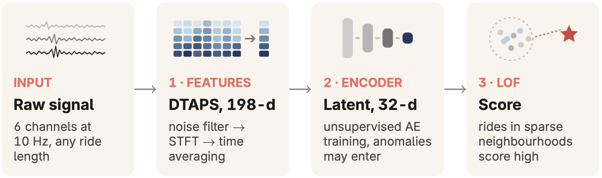
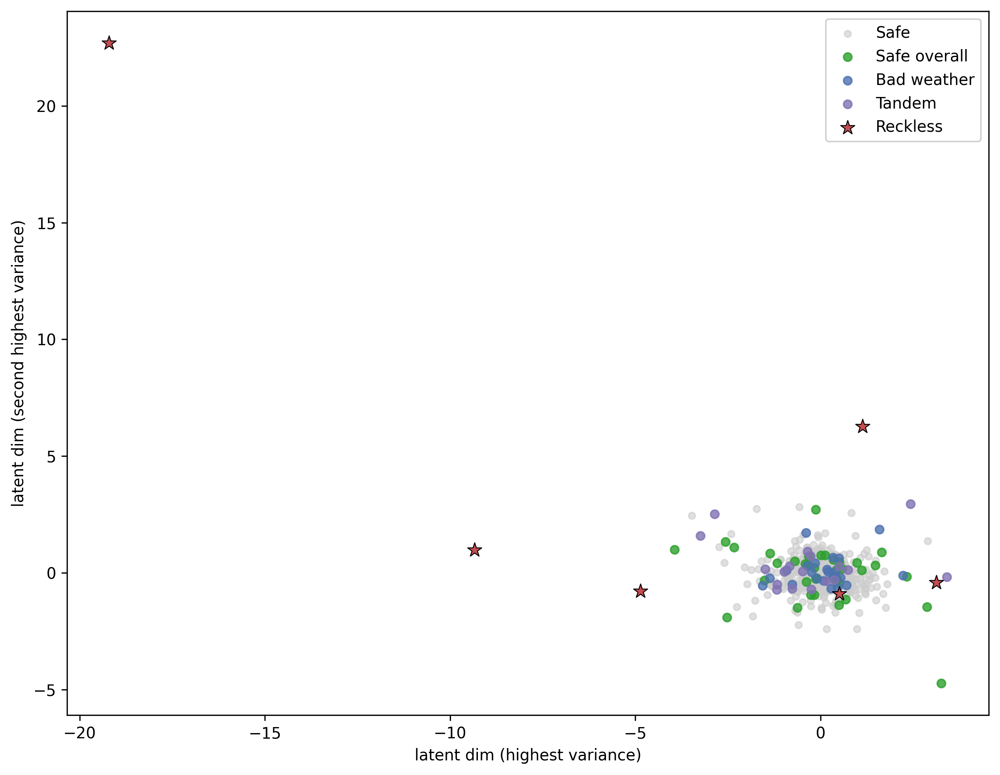

# Ride anomaly scoring

<p align="center">
  <a href="https://ecmlpkdd.org/2026/"></a>
  <a href="LICENSE"></a>
  <a href="LICENSE-CC-BY-4.0.txt"></a>
  
  
</p>



Code and data to reproduce the results from "Unsupervised Anomaly Scoring of E-Scooter Inertial Signals for Safety Quantification" accepted at [ECML PKDD 2026](https://ecmlpkdd.org/2026/). The method assigns each e-scooter ride an anomaly score from raw IMU data — a 3-axis accelerometer and 3-axis gyroscope sampled at 10 Hz — without supervision, where higher scores indicate more reckless, crash-prone riding.

**Pipeline:** Raw IMU → FIR low-pass denoising → STFT spectrograms → time-average pooling → dimensionality reduction → anomaly scoring. We refer to the denoised time-average pooled spectrogram features as DTAPS.

**Proposed method:** DTAPS + Autoencoder + Local Outlier Factor — AP = 0.77 on GBG500; OR ≈ 2.4 per 1-SD (p < 0.001), ≈ 4.7 at the 95th score percentile (p < 0.001) on SRV3490 confirmed-crash data.

## Table of Contents
- [Ride anomaly scoring](#ride-anomaly-scoring)
  - [Table of Contents](#table-of-contents)
  - [Prerequisites](#prerequisites)
  - [Data](#data)
  - [Notebooks](#notebooks)
  - [Running notebooks (batch)](#running-notebooks-batch)
  - [Generate statistics from output](#generate-statistics-from-output)
  - [Results](#results)
    - [GBG500 — Average Precision (30 seeds, 5-fold stratified CV)](#gbg500--average-precision-30-seeds-5-fold-stratified-cv)
    - [GBG500 — Latent space (DTAPS + AE, out-of-fold, median AP seed)](#gbg500--latent-space-dtaps--ae-out-of-fold-median-ap-seed)
    - [SRV3490 — Odds Ratio Analysis (30 seeds, 5-fold group CV, DTAPS + AE + LOF)](#srv3490--odds-ratio-analysis-30-seeds-5-fold-group-cv-dtaps--ae--lof)
  - [Preprint](#preprint)
  - [How to cite](#how-to-cite)
  - [License](#license)


## Prerequisites
The datasets are stored with [Git LFS](https://git-lfs.com/). Install it first, then clone the repository so the `.parquet` files are fetched:

```bash
git lfs install
git clone https://github.com/voiapp/ride-anomaly-scoring.git
cd ride-anomaly-scoring
```
> **Note:** If you cloned before installing Git LFS, run `git lfs pull` to download the data.

Create and activate a virtual environment, then install dependencies:

```bash
python3.10 -m venv .venv
source .venv/bin/activate
pip install -r requirements.txt
```
> **Note:** When running notebooks, ensure the kernel is set to use the `.venv` environment.

## Data
- **Location**: `data/`
  - **`GBG500.parquet`**: Time index and IMU data for 500 rides in Gothenburg (Safe: 416, Safe Overall: 38, Bad Weather: 22, Tandem: 18, Reckless: 6). Reckless rides are the positive class we aim to detect; Safe rides are normal; the remaining categories (Safe Overall, Bad Weather, Tandem) are counterfactual — they lie near the decision boundary and should not be flagged as anomalies.
  - **`GBG500_labels.csv`**: GBG500 labels (used only for evaluation).
  - **`SRV3490.parquet`**: Time index and IMU data for 3490 rides in 8 cities across Europe. 698 rides contain topple (fall) events with user-confirmed crashes; the remaining rides have no known or detected topple events. For confirmed-crash rides, `crash_ride_id` is null; for baseline rides, it points to the associated confirmed-crash ride ID (4 baselines per crash).

## Notebooks
- **Location**: `notebooks/`
  - **`data_info.ipynb`**: Dataset overview — row counts, total hours, ride duration statistics, and missing-value analysis for GBG500 and SRV3490.
  - **`GBG500_spectral.ipynb`**: DTAPS feature extraction and anomaly detection for GBG500.
  - **`GBG500_spectral_pca.ipynb`**: DTAPS + PCA dimensionality reduction and anomaly detection for GBG500.
  - **`GBG500_spectral_baselines.ipynb`**: Simple baseline anomaly detection methods for GBG500.
  - **`GBG500_spectral_ae.ipynb`**: DTAPS + AE dimensionality reduction and anomaly detection for GBG500.
  - **`GBG500_spectral_svdd.ipynb`**: DTAPS + Deep SVDD (Ruff et al., ICML 2018) and anomaly detection for GBG500.
  - **`GBG500_ts2vec.ipynb`**: TS2Vec (Yue et al., AAAI 2022) and anomaly detection for GBG500.
  - **`GBG500_minirocket.ipynb`**: MiniRocket (Dempster et al., KDD 2021) and anomaly detection for GBG500.
  - **`GBG500_latent_viz.ipynb`**: Visualizes the GBG500 dataset in the AE latent space using out-of-fold encoder representations (proposed method, median AP seed), plotting the two latent dimensions with the highest variance colored by ride category.
  - **`SRV3490_or_analysis.ipynb`**: DTAPS + AE + LOF odds ratio analysis on SRV3490 via conditional logistic regression.
> **Note:** Proposed method for GBG500: DTAPS + AE with LOF.

## Running notebooks (batch)
Use `run_notebooks.py` to execute notebooks via papermill multiple times with different seeds; outputs are written to the default `output/` directory with `_seed_<N>` appended.

```bash
# GBG500 spectral + PCA (30 runs each) - parallelism defaults to --n_jobs=-1
python run_notebooks.py notebooks/GBG500_spectral{,_pca}.ipynb --n_runs=30

# GBG500 baselines (run once)
python run_notebooks.py notebooks/GBG500_spectral_baselines.ipynb --n_runs=1

# GBG500 AE + Deep SVDD + MiniRocket baselines (30 runs)
python run_notebooks.py notebooks/GBG500_spectral_{ae,svdd}.ipynb notebooks/GBG500_minirocket.ipynb --n_runs=30 --n_jobs=8

# GBG500 TS2Vec baseline (30 runs)
python run_notebooks.py notebooks/GBG500_ts2vec.ipynb --n_runs=30 --n_jobs=1

# SRV3490 analysis (30 runs)
python run_notebooks.py notebooks/SRV3490_or_analysis.ipynb --n_runs=30 --n_jobs=2
```

## Generate statistics from output
After running notebooks, you can extract all scrapbook `glue` values from the executed notebooks in `output/` and aggregate summary statistics to a single CSV (per `glue_key`: `count`, `mean`, `std`, `min`, `max` and quartiles; `std` may be empty when `count=1`):

```bash
python generate_stats.py
```

This writes `output/statistics.csv`.

## Results
Pre-computed aggregated statistics are available in `results/statistics.csv`. GBG500 notebooks use 5-fold stratified CV; SRV3490 uses 5-fold group CV (splitting by crash group to preserve the matched case-control design). Labels are held out and used only for the metrics below. Results are aggregated over 30 random seeds.

### GBG500 — Average Precision (30 seeds, 5-fold stratified CV)

*Simple baselines*

| Features | Dim. Reduction | Scorer              | AP (mean ± std) |
|----------|----------------|---------------------|-----------------|
| Random   | —              | —                   | 0.012           |
| DTAPS    | —              | Mean spectral power | 0.667           |

*Ablation study*

| Features  | Dim. Reduction | Scorer               | AP (mean ± std)   |
|-----------|----------------|----------------------|-------------------|
| DTAPS     | AE             | IF                   | 0.612 ± 0.053     |
| **DTAPS** | **AE**         | **LOF**              | **0.771 ± 0.047** |
| DTAPS     | AE             | OC-SVM               | 0.382 ± 0.103     |
| DTAPS     | AE             | Reconstruction error | 0.620 ± 0.042     |
| DTAPS     | PCA            | IF                   | 0.570 ± 0.064     |
| DTAPS     | PCA            | LOF                  | 0.695 ± 0.017     |
| DTAPS     | PCA            | OC-SVM               | 0.391 ± 0.091     |
| DTAPS     | —              | IF                   | 0.543 ± 0.035     |
| DTAPS     | —              | LOF                  | 0.683 ± 0.026     |
| DTAPS     | —              | OC-SVM               | 0.364 ± 0.093     |
| DTAPS     | Deep SVDD      | Deep SVDD            | 0.565 ± 0.093     |

*Time-domain representations*

| Features   | Dim. Reduction | Scorer | AP (mean ± std) |
|------------|----------------|--------|-----------------|
| TS2Vec     | —              | IF     | 0.167 ± 0.087   |
| TS2Vec     | —              | LOF    | 0.237 ± 0.111   |
| TS2Vec     | —              | OC-SVM | 0.220 ± 0.106   |
| MiniRocket | —              | IF     | 0.276 ± 0.043   |
| MiniRocket | —              | LOF    | 0.477 ± 0.054   |
| MiniRocket | —              | OC-SVM | 0.518 ± 0.046   |
| MiniRocket | PCA            | IF     | 0.342 ± 0.045   |
| MiniRocket | PCA            | LOF    | 0.487 ± 0.032   |
| MiniRocket | PCA            | OC-SVM | 0.536 ± 0.022   |

### GBG500 — Latent space (DTAPS + AE, out-of-fold, median AP seed)

Out-of-fold autoencoder latent representations of the GBG500 rides (each ride encoded by the fold in which it was held out), projected onto the two latent dimensions with the highest variance.



### SRV3490 — Odds Ratio Analysis (30 seeds, 5-fold group CV, DTAPS + AE + LOF)

Conditional logistic regression on confirmed-crash vs. matched-baseline rides (4 baselines per crash, all rides truncated 10 s before the topple event):

| Analysis              | OR median [IQR]   | p-value (median) | p < 0.001 |
|-----------------------|-------------------|------------------|-----------|
| Continuous (per 1-SD) | 2.44 [2.38, 2.53] | 2.1 × 10⁻⁶⁰      | 100%      |
| Top 5 %               | 4.70 [4.24, 5.16] | 2.2 × 10⁻²⁰      | 100%      |

## Preprint

Coming soon.

## How to cite

This work has been accepted at [ECML PKDD 2026](https://ecmlpkdd.org/2026/) (Naples, Italy, 7–11 September 2026). A suggested citation will be provided as soon as the proceedings are published.

## License
- **Code**: [MIT](LICENSE).
- **Data** (`data/`): [CC BY 4.0](LICENSE-CC-BY-4.0.txt).
